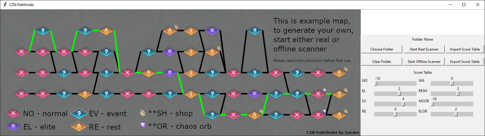

# CZN Pathfinder - find the best way to navigate chaos maps

## Features

### Reconstruct full map

-   Automatic scanner mode, takes control of your mouse to take screenshots from chaos map
-   Offline mode, reads saved screenshots from folder

### Highlight best path

-   Adjustable weight, allows for various path settings, like 'Maximum elites', 'Minimum normals' or 'Prioritize events while avoiding normals but accept chaos gem fights'
-   Updates in real time, as you change weights located on the right side

## Automatic scan demo

Here's how automatic scan looks in action:

## Installation

### If you have python installed

-   pip install -r requirements.txt
-   then run gui.py

### If you do not have python

-   Download exe archive from releases, unpack, run CZN Pathfinder.exe

### Please read instructions.txt before first use

## Notes

Automatic scanner requires admin elevation (right click / run as administrator).
The game is elevated itself, and lower process cant send signals to higher process or something. Offline mode can work without it.  
This is a convenience  tool, not a bot or cheat. It displays the full map and the optimal path. 
It does not run the map for you. It does not modify or inject any code into the game. 
It DOES emulate user input to scroll opened chaos map, but that action provides no unfair account advantage compared to something like autofarmers.
