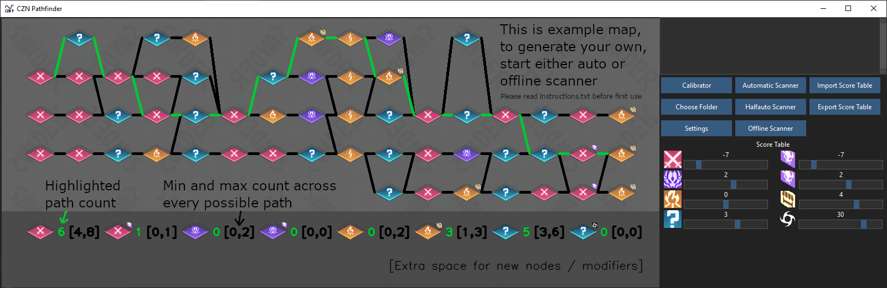
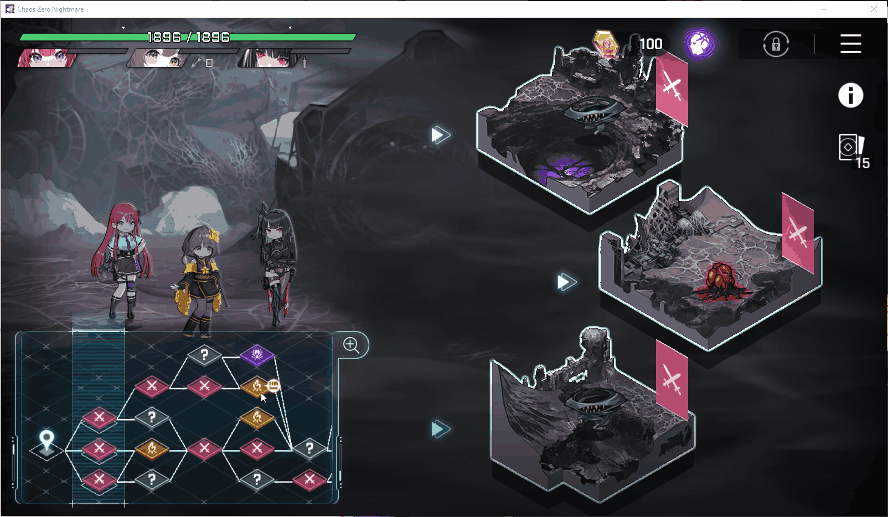

# CZN Pathfinder - find the best way to navigate chaos maps


Reveal the full chaos map, calculate the best possible route, and adjust path priorities in real time.<br>
Designed for fast in-game use with automatic scanning, mini overlay mode and keyboard shortcuts.

## Features

### Full map reconstruction

Use one of three scan modes:
<table>
<tr>
<td>Automatic</td>
<td>Script controls the mouse and scans the map automatically</td>
</tr>
<tr>
<td>Half-automatic</td>
<td>You move the map manually, script captures screenshots</td>
</tr>
<tr>
<td>Offline</td>
<td>Load screenshots from folder and process them</td>
</tr>
</table>

### Real-time pathfinding

Adjust encounter priorities and instantly recalculate the best route.
Examples:

- maximize events
- prefer elites to normal fights
- prioritize shops but avoid rests

The map updates immediately when score values change.

### Interactive calibration tool

Built-in calibration window allows the script recognize nodes correctly for your game resolution.<br>
Captures screenshots from opened game or saved image, then labels every visible node and draws paths, helping you
understand how the script sees.

### Mini mode

Double-click the map to collapse the UI into a compact always-on-top overlay that stays visible while playing.<br>
Best used together with keyboard shortcuts enabled, to fully eliminate the need to alt-tab.

## Automatic scan demo

Here's how calibration and automatic scan looks in action:

You can also test how the script works by using built-in demo, together with provided fake chaos map.

## Installation

### Option 1 - executable release (recommended)

- Download the latest exe release
- Extract it anywhere
- Run CZN Pathfinder.exe

### Option 2 - run from source

Requires Python installed.

```
git clone https://github.com/SanderSzkola/CZN_Pathfinder
cd CZN_Pathfinder
pip install -r requirements.txt
python app.py
```
You can create your own exe by installing PyInstaller and running build.py from utils folder.

### Please read instructions.txt before first use

## Notes

Automatic and half-automatic scanners require admin elevation (right click / run as administrator).
The game is elevated itself, and lower process cant send signals to higher process or something. Offline mode can work
without it.<br>
Automatic mode controls your mouse to move chaos map. You should observe it closely while it works, if the automated
action looks wrong, quickly move mouse to top-left corner of your screen to stop it.<br><br>
Designed for Windows and 16x9 screen resolution, should work up to 4k.<br><br>
This is a convenience tool, not a bot or cheat. It displays the full map and the optimal path, based only on images
the game displayed to the player.<br>
It does not run the map for you. It does not modify or inject any code into the game. It does not have access to any
hidden or unintentional data.<br>
It does not provide any unfair account advantage compared to something like autofarmers.<br>
It DOES emulate user input to scroll opened chaos map, but that action does not advance game's state. 
